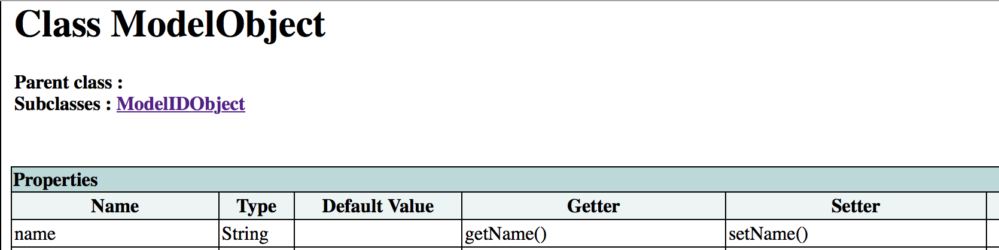
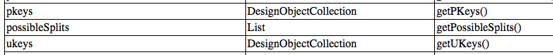
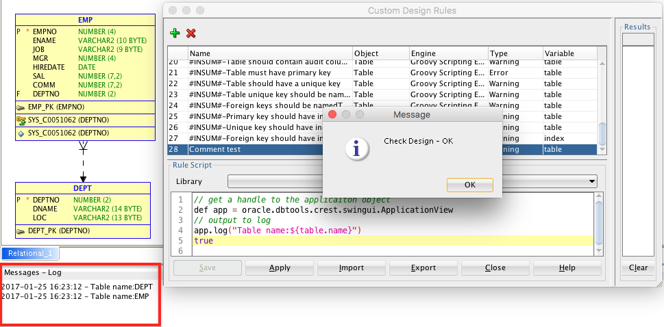
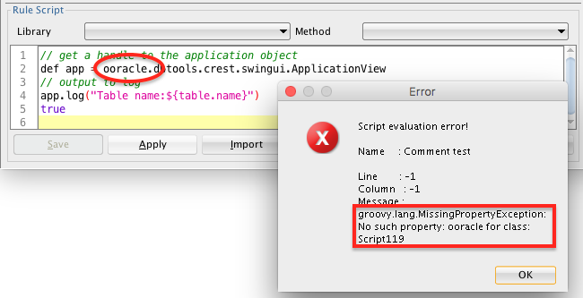

## Groovy Goodness
1. Groovy syntax is very similar to Java, JavaScript and other scripting languages. Most Java or JavaScript code is valid Groovy code.
2. Groovy comments are designated using `// comment` or `/* comment */`.
3. Using Groovy, properties that are accessed using getters and setters can be retrieved and set by simply referencing the property name. For example, as seen below, the ultimate parent of the Table object, has a name property. Instead of accessing the propery using the getter, `table.getName()`, you can access the name property thusly: `table.name`. This also works to set the property value. In this case `table.setName('EMP')` becomes `table.name = 'EMP'`.
 

4. Some properties are actually collections rather than scalar values. For example, as seen in the *index.html* file, the unique and primary keys of a table are referenced as a collection. Please note that a `DesignObject` is the parent class for many types of objects. In this case, the entire collection can be referenced directly from the table object like this: `table.UKeys`.
 

 Typically, the property will be the lower-case version of the item `table.getName() == table.name`, however as is seen here, if the property begins with two upper-case letters, that is carried over in the property name `table.getPKeys() == table.PKeys`.

5. The collections used in the SDDM model are primarily Java List objects. Groovy lists are easy to work with and have many helper methods, some handy ones are described [here](http://grails.asia/groovy-list-tutorial-and-examples).

6. Groovy has  full support for regular expressions. The use of the extremely handy matcher operator is detailed [here](http://mrhaki.blogspot.com/2009/09/groovy-goodness-matchers-for-regular.html).

7. Groovy strings can be denoted with either single or double quotes. String elements can be accessed using a 0-based array. The last member of a string can be retrieved using an index of -1, the second-last using -2 and so on. There are a multitude of convenience methods on strings. A good listing can be found [here](https://www.tutorialspoint.com/groovy/groovy_strings.htm).
8. Debugging can be tricky, but you can send messages to the application log window like this:
```groovy
// get a handle to the application object
def app = oracle.dbtools.crest.swingui.ApplicationView
// output to log
app.log("Table name:${table.name}")
```
However, using SDDM^Plus, you can simply use the *log()* method with no set up, like this:
```groovy
// output to log using sddm-plus
log("Table name:${table.name}")
```
Click on **Apply**, and the output appears in the **Messages - Log** pane. If the Log pane is not visible, select **View | Log** from the top-level menu.

 

9. In the event that you make a coding mistake, script errors will appear in a separate **Error** dialog popup. If you are using more than one monitor the error window may show up on another monitor.

 

10. Control structures in Groovy are similar to those found in most programming languages. For example *for* loops can be defined the old-fashoned way using `for (i=0; i < j; i++) { ... }`, but they can also be defined using the *in* syntax. For example  `for (table in tables) { ... }` will loop through all of the objects in the *tables* list.

11. Automatic iterators and closures are a very powerful aspects of Groovy programming that become second nature very quickly. You don't need to know much about either of these topics to take advantage of them so I will not go into detail here. If you are curious, there are numerious sources on the web where you can learn more, but suffice it to say that a closure is like a function or method, and the built-in iterators use closures to make working with collections very efficient and easy. In the example below, we are using the **sddm-plus** methods, getTables() and getColumns() (abbreviated as described above) to print the table names and the associated colums from a model to a file. We use the *each{}* closure to iterate through the list of tables in the model and the columns in the table. The *<<* operator makes adding content to a file extremely easy. Groovy takes care of opening and closing the file for you.

 ```groovy
def file = new File('Desktop/test.txt')
// using sddm-plus commands
tables.each { table ->
  file << "Table: ${table.name}\n"
  table.columns.each { col ->
    file << "  col: ${col.name}\n"
  }
}
```
