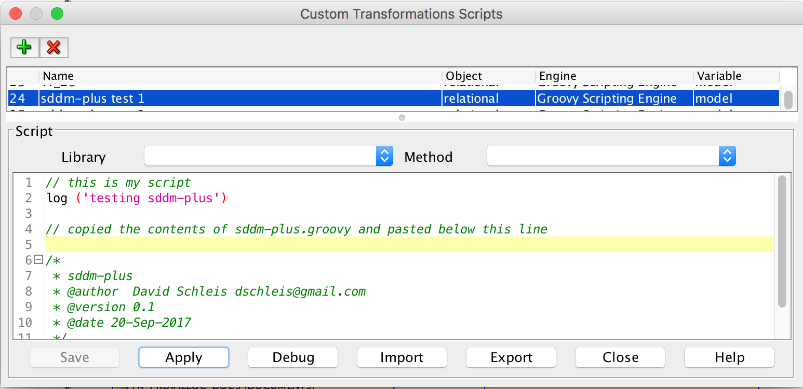
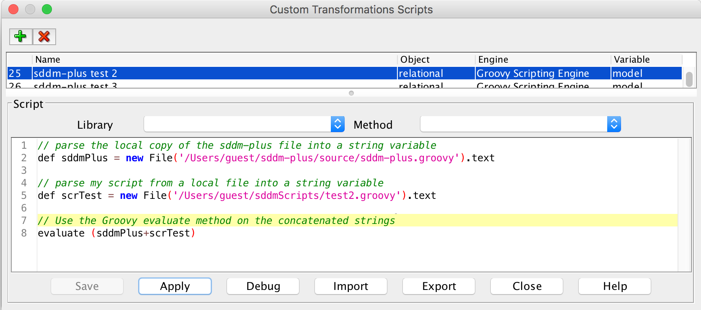
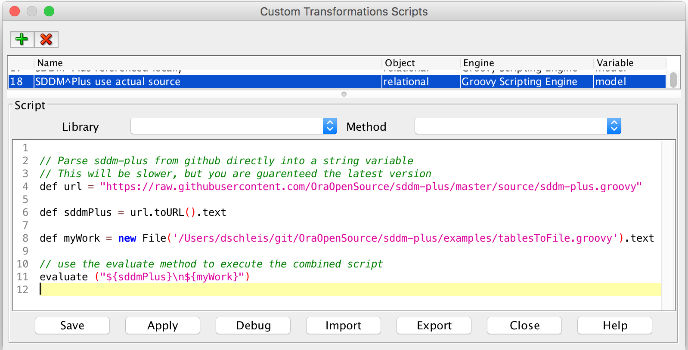

## Using SDDM^Plus

To take advantage of the SDDM^Plus  methods, the contents of sddm-plus.groovy must be included in the script that is run from within Data Modeler in some way.

You can include sddm-plus.groovy can by:
1. Appending the contents of sqlGr to your script

2. Concatenating your external script with a local copy of sddm-plus.groovy.

```groovy
// parse the local copy of the sddm-plus file into a string variable
def sddmPlus = new File('/Users/guest/sddm-plus/source/sddm-plus.groovy').text

// parse my script from a local file into a string variable
def scrTest = new File('/Users/guest/sddmScripts/test2.groovy').text

// Use the Groovy evaluate method on the concatenated strings
evaluate (sddmPlus+scrTest)
```
3. Concatenating your external script with the reference version of sddm-plus.groovy. This takes a bit longer to run, but you are guaranteed to have the latest version of the script helpers.

```groovy
// parse the local copy of the sqlGr file into a string variable
def sddmPlus = 'https://raw.githubusercontent.com/dschleis/sddm-plus/master/source/sddm-plus.groovy'.toURL()

// parse my script from a local file into a string variable
def scrTest = new File('/Users/guest/sddmScripts/test3.groovy').text

// Use the Groovy evaluate method on the concatenated strings
evaluate (sddmPlus + scrTest)
```
